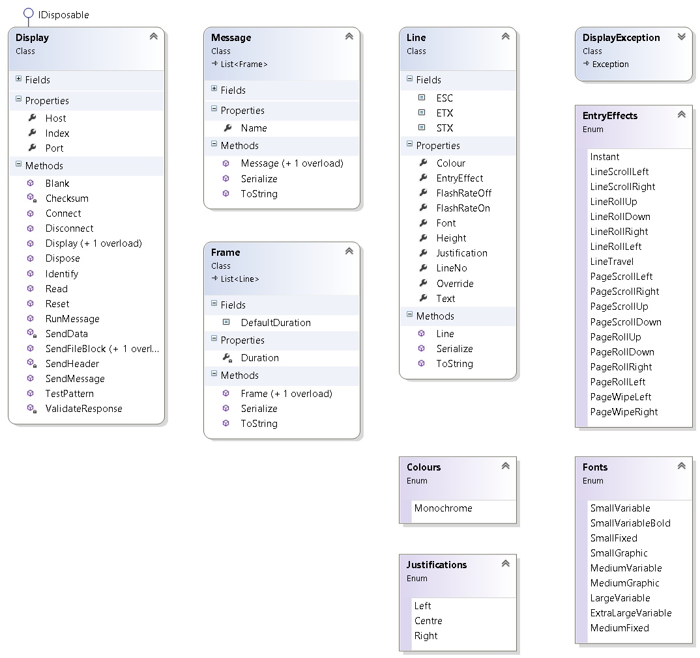

MDC
===
`RedCell.Devices.LedDisplay.Daktronics`

A .NET C# class library that implements the **Multipurpose Display Controller** protocol used by Daktronics LED displays,
facilitating communication between a computer and a Daktronics Galaxy (and others) LED pixel display over the network, 
using a proprietary TCP-based protocol.

System Requirements
-------------------
* The .NET Framework 3.5 redistributable (or later) is required.
* A 128kb/s always-on network connection is required.

Multipurpose Display Controller Protocol
----------------------------------------
This *Display Driver module* is a .NET class library that implements a high-level wrapper for a *subset* of the low-level MDC protocol. 
1.	The sign (server role) accepts TCP connections on port 3001.
2.	A client makes a socket connection with the sign.
3.	All communications to and from the sign consist of a 6-byte header and (if required), a variable-length body. Both the header and body include a 1-byte checksum.
4.	The client sends an IDENTIFY request (6 + 0 bytes).
5.	The sign responds (6 + 3 bytes).
6.	The client sends a COMMAND to the sign (6 + x bytes).
7.	The sign accepts or rejects the command and responds with a confirmation (6 + x bytes).

The MDC protocol and command set are documented in detail in the compiled help file, `MDCHelp.chm`. The following is a brief summary for context only.

The sign supports two command protocols, **MDC** and **M2** (short for *MDC version 3*).
* MDC (version 1) is primarily a binary language, consisting of a header and a terse command.
* M2 (version 3) is more complex, consisting of a binary header and exchange of XML files. M2 is a superset of MDC, and in theory, commands in both protocols can be used (untested).
* Version 2 of the protocol was not released.

MDC version 1 is preferred for projects when possible because:
* It supports all of the required functionality.
* It is considerably simpler.
* It requires minimal bandwidth, yet includes error detection.

Module Design
-------------

### Display
The `Display` class is the module’s controller. Its methods wrap a subset of the available MDC commands. Simple use of the class looks like:

	/// 

	/// Clears the display.
	/// 

	public void Clear()
	{
		using(var display = new Display(_host, _port, _index))
		{
			display.Connect();
			display.Identify();
			display.Blank();
			display.Disconnect();
		}
	}

An `Identify` command must be sent at the beginning of each transmission. It both checks the state of the display, and tells the sign which version of the MDC protocol will be used.

### Messages, Frames, Lines

The data sent to the sign to display a message consists of a *message*, *frame(s)*, and *line(s)*. These are represented by the `Message`, `Frame`, and `Line` classes.

A message consists of one or more frames. The message has a filename, and is stored in the device's non-volatile memory. Since the display cycles through messages, and this behaviour is undesirable for this project, all messages sent to the sign use the same filename.

Each frame contains one or more lines, and the amount of time to show the frame.
Each line includes text, font, justification, intensity, and entry/exit/flash effect details. Where appropriate, these are represented by enums.

This example demonstrates sending a simple message to the display *(the _display field is already instantiated)*:
There are several steps in sending a message to the display.
1. Connect to the display.
2. Initiate communication with Identify.
3. Construct a message, and SendMessage, to declare it.
4. Define the actual content with SendFileBlock.
5. Show the message with RunMessage.

    /// 

    /// Shows a "STOP Contact YCC" message.
    /// 

    public void StopContact()
    {
        var message = new Message("TTC")
        {
            new Frame
            {
                new Line(1, "STOP", Fonts.MediumFixed, Justifications.Centre),
                new Line(2, "Contact YCC", Fonts.MediumVariable, Justifications.Centre),
            }
        };
        _display.Connect();
        _display.Identify();
        _display.SendMessage(message);
        _display.SendFileBlock(message);
        _display.RunMessage(message);
        _display.Disconnect();
    }
